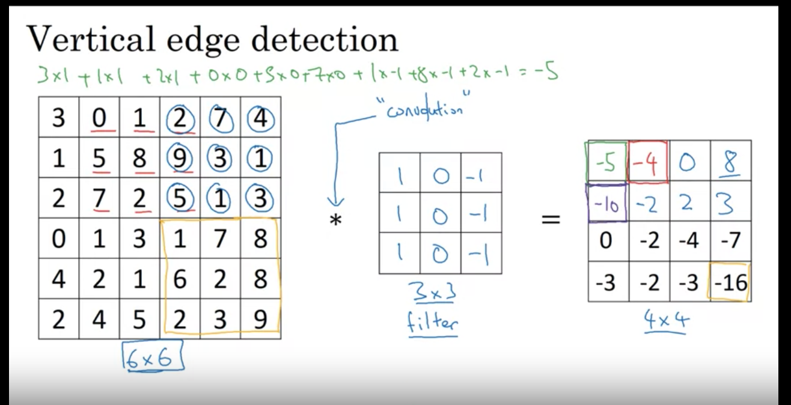

## Convolutional Neural Network
A deep learning network where one or more convolution layers make up part of the deep neural net.

A "convolution" is basically some type of transformation applied to the input; 
in this case a matrix where a "filter" or "kernel" matrix is applied to get a 
new matrix. This is done to extract features like lines and contours from the 
input which can be used in the neural net in subsequent layers.

**Example**: a 6 x 6 matrix which represents an image is transformed by a 3 x 3 matrix
which represents a filter. By doing element wise multiplication/addition with the 
smaller filter on each section of the larger image, we get a new 4 x 4 matrix. This is done by moving and applying the filter from top left to top right 1 pixel at a time and then moving 1 pixel down starting from the left again and going to the right again.

*from Andrew Ng: Convolutional Neural Networks*

### Some Use Cases
- Image classification
- Object Detection
- Neural Style Transfer (Create a new image from an original image using the style of another image. Example: Mona Lisa image but in the style of Picasso)

### Filters
There are many types of filters that can be used in processing an image.  The previous example had a filter which can detect vertical lines.
### Calculate new matrix size (formulas)
TBD
### Padding
In large DNN models with many layers, the input image to subsequent layers may be too small
TBD

### Volume
You can also perform convolution on images that have more than 2 dimensions.  For example, RGB images have 3 color channels.  Just make sure the filter being applied also has the same number of channels.  The output will be a 2 dimensional matrix.